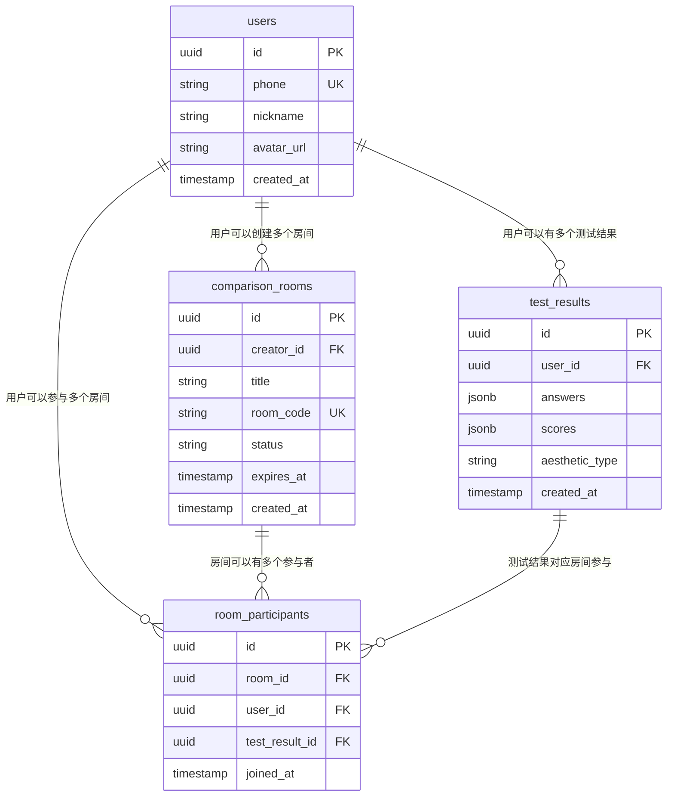

# 🗄️ AesthetiMatch 数据库设计

## 📋 设计原则

### 敏捷数据库设计策略

- **最小化可行设计**：只设计MVP功能必需的表
- **渐进式扩展**：根据功能开发逐步添加字段和表
- **Supabase优势**：利用PostgreSQL的灵活性和实时功能
- **快速迭代**：表结构修改成本低，支持快速调整

---

## 🎯 核心数据模型

### 1. 用户表 (users)

```sql
CREATE TABLE users (
  id UUID PRIMARY KEY DEFAULT gen_random_uuid(),
  phone VARCHAR(20) UNIQUE,
  nickname VARCHAR(50),
  avatar_url TEXT,
  created_at TIMESTAMP DEFAULT NOW(),
  updated_at TIMESTAMP DEFAULT NOW()
);
```

**字段说明**：

- `id`: 用户唯一标识
- `phone`: 手机号（用于登录）
- `nickname`: 用户昵称
- `avatar_url`: 头像链接
- 时间戳字段：自动管理创建和更新时间

### 2. 测试结果表 (test_results)

```sql
CREATE TABLE test_results (
  id UUID PRIMARY KEY DEFAULT gen_random_uuid(),
  user_id UUID REFERENCES users(id),
  answers JSONB NOT NULL,
  scores JSONB NOT NULL,
  aesthetic_type VARCHAR(50),
  created_at TIMESTAMP DEFAULT NOW()
);
```

**字段说明**：

- `answers`: 存储用户所有答题数据（JSON格式）
- `scores`: 六维审美评分（JSON格式）
- `aesthetic_type`: 审美类型标签（如"温暖经典型"）

**示例数据**：

```json
// answers 格式
{
  "question_1": {"choice": "A", "time": 3.2},
  "question_2": {"choice": "B", "time": 2.1}
}

// scores 格式
{
  "classic": 85,
  "modern": 62,
  "elegant": 78,
  "natural": 45,
  "warm": 92,
  "mysterious": 38
}
```

### 3. 对比房间表 (comparison_rooms)

```sql
CREATE TABLE comparison_rooms (
  id UUID PRIMARY KEY DEFAULT gen_random_uuid(),
  creator_id UUID REFERENCES users(id),
  title VARCHAR(100),
  room_code VARCHAR(10) UNIQUE,
  status VARCHAR(20) DEFAULT 'active',
  expires_at TIMESTAMP,
  created_at TIMESTAMP DEFAULT NOW()
);
```

**字段说明**：

- `room_code`: 6位邀请码（如：ABC123）
- `status`: active/completed/expired
- `expires_at`: 房间过期时间（24小时）

### 4. 房间参与者表 (room_participants)

```sql
CREATE TABLE room_participants (
  id UUID PRIMARY KEY DEFAULT gen_random_uuid(),
  room_id UUID REFERENCES comparison_rooms(id),
  user_id UUID REFERENCES users(id),
  test_result_id UUID REFERENCES test_results(id),
  joined_at TIMESTAMP DEFAULT NOW(),
  UNIQUE(room_id, user_id)
);
```

---

## 🔄 数据关系图



---

## 📊 Supabase 配置

### Row Level Security (RLS) 策略

```sql
-- 用户只能看到自己的测试结果
CREATE POLICY "Users can view own test results" ON test_results
  FOR SELECT USING (auth.uid() = user_id);

-- 房间参与者可以查看房间信息
CREATE POLICY "Participants can view room" ON comparison_rooms
  FOR SELECT USING (
    id IN (
      SELECT room_id FROM room_participants
      WHERE user_id = auth.uid()
    )
  );
```

### 实时订阅配置

```javascript
// 监听房间状态变化
supabase
  .channel("room_updates")
  .on(
    "postgres_changes",
    {
      event: "*",
      schema: "public",
      table: "room_participants",
    },
    (payload) => {
      console.log("房间参与者变化:", payload);
    }
  )
  .subscribe();
```

---

## 🚀 扩展计划

### Sprint 2 可能添加的表

```sql
-- 题目库表（如果需要动态题目）
CREATE TABLE questions (
  id UUID PRIMARY KEY DEFAULT gen_random_uuid(),
  category VARCHAR(50),
  question_text TEXT,
  image_a_url TEXT,
  image_b_url TEXT,
  difficulty_level INTEGER DEFAULT 1
);

-- 分享记录表（用于传播分析）
CREATE TABLE share_records (
  id UUID PRIMARY KEY DEFAULT gen_random_uuid(),
  user_id UUID REFERENCES users(id),
  platform VARCHAR(50),
  shared_at TIMESTAMP DEFAULT NOW()
);
```

### 性能优化索引

```sql
-- 基础索引
CREATE INDEX idx_test_results_user_id ON test_results(user_id);
CREATE INDEX idx_test_results_created_at ON test_results(created_at);
CREATE INDEX idx_comparison_rooms_room_code ON comparison_rooms(room_code);
CREATE INDEX idx_room_participants_room_id ON room_participants(room_id);
```

---

## ✅ 开发建议

### 第一天数据库设置

1. 在Supabase创建以上4个核心表
2. 配置RLS策略确保数据安全
3. 测试基础的CRUD操作

### 渐进式数据建模

- **MVP阶段**：只使用核心4表
- **功能扩展**：根据需求添加新表
- **性能优化**：监控查询性能，适时添加索引

### 数据库迁移策略

```javascript
// 使用版本控制管理表结构变更
migrations/
├── 001_create_core_tables.sql
├── 002_add_questions_table.sql
└── 003_add_share_records.sql
```

这个设计支持快速开发和迭代，同时为未来功能扩展预留了空间。
